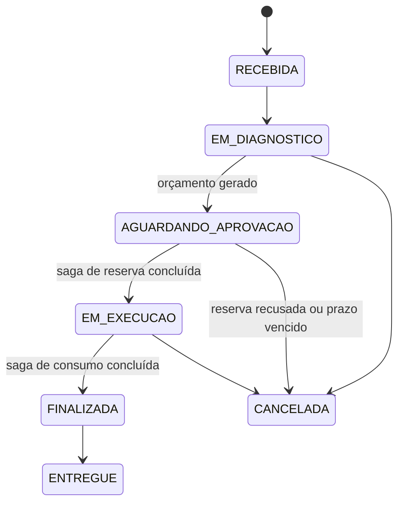

# Saga da ordem de serviço

## Data
06/10/2026

Contrato da transação distribuída que a Fase 4 exige. A decisão que o sustenta é a
`GLOBAL-ADR-010`, que atravessa repositórios e por isso vive fora deste.
Este serviço é o **orquestrador** (`GLOBAL-ADR-007`): ele é dono do estado da OS e de em que
etapa da saga ela está.

Esquemas do contrato: [`../contratos/estoque/`](../contratos/estoque/).

---

## Onde a saga encaixa na máquina de estado

A máquina de estado da OS já existia no monólito e **não muda** por causa da saga. O que a
saga faz é ocupar o intervalo entre duas transições, enquanto outros serviços respondem.



Duas sagas, não uma:

| Saga | Abre em | Fecha em |
|---|---|---|
| **reserva** | aprovação do orçamento | `EM_EXECUCAO` ou `CANCELADA` |
| **consumo** | pedido de finalização | `FINALIZADA` ou volta a `EM_EXECUCAO` |

**O estado só avança quando a saga confirma.** Enquanto a reserva está em curso a OS continua
em `AGUARDANDO_APROVACAO`, e não existe estado intermediário visível ao cliente — o progresso
da saga vive em tabela própria do orquestrador, não no enum da OS. Inventar
`AGUARDANDO_RESERVA` poluiria o domínio com detalhe de infraestrutura.

> **Consequência para a etapa 3:** `OrdemServico.aprovarOrcamento()` hoje aprova o orçamento
> **e** transiciona para `EM_EXECUCAO` numa chamada. A saga precisa dos dois passos separados:
> aprovar o orçamento abre a saga, e a transição acontece na confirmação. Mesma coisa em
> `finalizar()`. É a única mudança que este contrato impõe ao agregado.

---

## Identidade da saga

**O identificador da saga é o `ordemServicoId`.** Não há segundo identificador.

Três coisas dependem disso e seriam separadas sem ele: a chave da mensagem no broker (que
preserva a ordem entre passos da mesma OS), a chave de idempotência dos comandos, e a consulta
do operador, que chega sabendo o número da OS e nada mais.

Uma OS tem no máximo uma saga em curso. Reabrir a mesma etapa reutiliza a mesma identidade — é
o que torna a reentrega inofensiva.

---

## Etapas

| Etapa | Comando publicado | Serviço | Sucesso | Falha | Compensação |
|---|---|---|---|---|---|
| `RESERVA_DE_INSUMOS` | `ReservarEstoque`, um por insumo | catálogo | `EstoqueReservado` | `ReservaRecusada` | `LIBERACAO_DE_INSUMOS` |
| `COBRANCA` | **a definir** — `GLOBAL-RFC-011` | checkout | — | — | `ESTORNO_DA_COBRANCA` |
| `CONSUMO_DE_INSUMOS` | `ConsumirReserva`, um por insumo | catálogo | `EstoqueConsumido` | `ConsumoRecusado` | nenhuma |
| `LIBERACAO_DE_INSUMOS` | `LiberarReserva`, um por insumo reservado | catálogo | `ReservaLiberada` | — | — |

`COBRANCA` está declarada e **vazia de propósito**. A `GLOBAL-RFC-011` ainda não fechou e a
resposta sobre o webhook em ambiente efêmero pode mudar o desenho do passo inteiro. Declarar a
etapa agora custa uma linha; descobrir depois que a máquina de estado não tem lugar para ela
custa retrabalho.

### Consumo não tem compensação

Baixar o reservado é irreversível pelo contrato do catálogo: `ConsumirReserva` não devolve
nada, e não existe comando que desconsuma. Por isso o consumo é o **último** passo com efeito
externo — nada que possa falhar vem depois dele. É a regra que torna a saga desenhável sem
compensação do último passo.

### Reserva parcial é falha da etapa

Uma etapa de reserva com cinco insumos só é bem-sucedida com cinco `EstoqueReservado`. Um
`ReservaRecusada` entre eles reprova a etapa inteira, e a compensação libera **as reservas que
deram certo** — não as recusadas, que nunca existiram. `LiberarReserva` para uma reserva que
não existe é operação nula no catálogo, então errar para o lado de compensar a mais é seguro.

---

## Chave de idempotência

```
idMensagem = <ordemServicoId>:<ETAPA>:<insumoId>
```

Determinística, o que significa que a retentativa do orquestrador produz a mesma chave sem
guardar estado extra, e legível, o que significa que uma linha de log ou uma mensagem na DLT
diz de que OS e de que etapa ela é. Chave aleatória obrigaria a abrir o payload para descobrir
as duas coisas.

**Orçamento de tamanho**, porque ele é apertado e ninguém o valida:

| Trecho | Teto |
|---|---|
| `ordemServicoId` | 36 |
| `ETAPA` | 20 — teto da convenção, nome mais longo hoje é `LIBERACAO_DE_INSUMOS` |
| `insumoId` | 36 |
| separadores | 2 |
| **chave** | **94**, que é o `maxLength` declarado no esquema |
| prefixo do tipo, que o catálogo acrescenta ao gravar no INBOX | 26, no tipo mais longo |
| **total gravado** | **120**, exatamente o tamanho de `INBOX.ID VARCHAR(120)` |

Não há folga. Nome de etapa com mais de 20 caracteres estoura o INBOX do catálogo, e o erro
aparece como falha de gravação no consumidor alheio, não aqui. O teto é regra, não sugestão —
e o teste de contrato do catálogo verifica a aritmética contra a coluna real.

Para `RegistrarEntradaDeEstoque`, que é ação humana e não passo de saga, a chave continua
sendo um UUID.

---

## Prazos: quem é dono do relógio

Dois temporizadores existem e **brigariam** se ninguém decidisse a hierarquia: o catálogo
expira reserva por conta própria, e o orquestrador tem prazo de etapa.

**O orquestrador é dono do relógio.** Toda `ReservarEstoque` carrega `expiraEm` — o campo
passou a ser obrigatório no contrato por isso — e vale sempre:

```
prazo do passo da saga  <  expiraEm da reserva
```

| Relógio | Valor | Papel |
|---|---|---|
| prazo do passo | 2 min | é o que reprova a etapa e dispara a compensação |
| `expiraEm` da reserva | 10 min | rede de segurança do catálogo para saga abandonada |
| rotina de expiração do catálogo | a cada 60 s | varre o que venceu |

Com essa ordem, o caminho normal é sempre a compensação explícita; a expiração do catálogo só
age quando o orquestrador morreu e não vai voltar — exatamente o caso em que a peça ficaria
presa para sempre.

### `ReservaExpirada` que a saga não pediu

Chega sem comando correspondente. O orquestrador trata pelo estado da etapa:

| Estado da etapa quando o evento chega | Ação |
|---|---|
| em curso ou reprovada | trata como falha do passo e compensa o resto; a reserva expirada já voltou ao estoque |
| concluída com sucesso | registra em `WARN` e ignora — significa que o prazo foi mal dimensionado |
| OS já `CANCELADA` ou `ENTREGUE` | registra em `INFO` e ignora |

Ignorar com log é diferente de ignorar em silêncio: `ReservaExpirada` em etapa concluída é
sintoma de prazo errado, e some se não for registrado.

---

## Rastreio

O `traceparent` no **cabeçalho** da mensagem é o trace canônico, e atravessa a fila sem código
nosso (`GLOBAL-ADR-007`, corrigido em 06/10/2026). O campo `traceId` do envelope continua no
contrato como redundância de depuração e **não participa** da correlação de spans — quem ler
só ele vê dois traces desconexos.

Uma lacuna conhecida: a OUTBOX publica em rotina agendada, fora do span que originou o evento,
então o consumidor entra num trace vizinho em vez de no mesmo. Fechar isso exige guardar o
`traceparent` inteiro na OUTBOX e restaurá-lo na publicação. Decidido em `GLOBAL-ADR-010`,
implementado na etapa 4.

---

## Gatilho de falha para a demonstração

O vídeo tem de mostrar a saga **tratando falha**, e provocar falha real em ambiente ao vivo é
frágil. Um insumo de SKU reservado no seed do catálogo recusa toda reserva, sempre. Abrir uma
OS com ele é o roteiro da compensação, e não depende de mexer em infraestrutura durante a
gravação. Implementado na etapa 4, junto do BDD.
